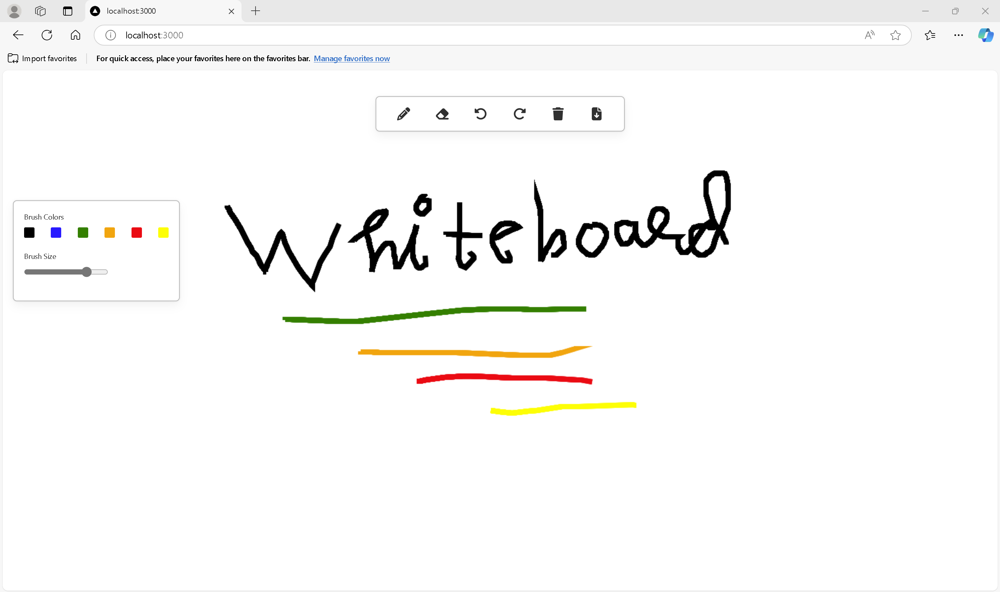
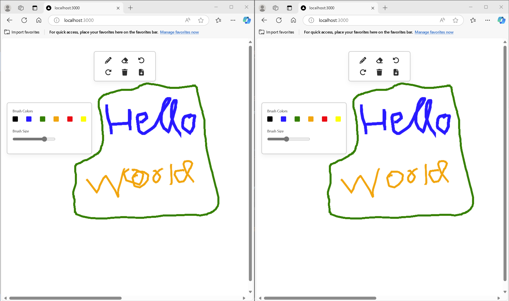

This is a [Next.js](https://nextjs.org/) project bootstrapped with [`create-next-app`](https://github.com/vercel/next.js/tree/canary/packages/create-next-app).

# Collaborative Whiteboard App

## Overview

- This is a real-time Collaborative Whiteboard application built with React, Redux, Socket.io, and Node.js. 
- The app allows multiple users to draw and interact with a shared canvas in real-time. 
- The core features include drawing, erasing, changing brush size and color, and more.

## Technologies Used:

- Frontend: React, Redux, CSS Modules, Socket.io Client
- Backend: Node.js, Express, Socket.io Server
- Real-Time Communication: WebSockets (using socket.io)
- State Management: Redux
- Deployment: Vercel

## Features

- Real-Time Drawing: Multiple users can draw on the whiteboard simultaneously.
- Brush Customization: Change the drawing color and size.
- Undo & Redo: Supports undo and redo actions to revert or repeat drawing actions.
- Eraser Tool: Allows users to erase their drawings.
- Background Color: Users can customize the background color.
- Save Canvas: Save your current whiteboard as an image.
- Multi-User Interaction: Alerts when two users are drawing at the same time.

## How It Works
- The app uses Socket.io for real-time communication, which allows multiple users to interact with the whiteboard in real-time. 
- Each drawing event (such as mouse movements, brush size/color changes, etc.) is emitted to the server, which broadcasts it to all other connected clients.

- When a user draws on the whiteboard, the client sends the drawing position, color, and brush size to the backend. 
- The backend then broadcasts these updates to all other users, who can see the changes in real-time.

## Installation
To get started with this project locally, follow these steps:

1. Clone the repository
``` bash
git clone https://github.com/rampalliprakhar/whiteboard.git
cd whiteboard
```
2. Install dependencies
For the frontend (React):

```bash
npm install
```
3. Run the app
Frontend (React):
```bash
npm run dev
```
Visit http://localhost:3000 in your browser to see the app in action.

## Usage

- Start Drawing: Click anywhere on the canvas to start drawing. You can adjust the brush color and size from the tool options on the left side.
- Undo/Redo: Use the buttons on the toolbar to undo or redo your last drawing action.
- Change Background Color: Click the background color options to change the whiteboard background.
- Clear the Board: Use the "Clear" button to clear the entire board.
- Save the Canvas: Click the "Save" button to save the current state of the canvas as an image.

## Prototype:





## Backend Architecture

[https://github.com/rampalliprakhar/whiteboardServer](https://github.com/rampalliprakhar/whiteboardServer)

The backend consists of an Express server with the following key features:

- Socket.io: Used for real-time bidirectional communication between clients and server.
- Active Drawers: The backend keeps track of users actively drawing on the whiteboard and notifies other users when two users are drawing simultaneously.
- Configuration Updates: When a user changes the brush color or size, or the background color, the configuration is broadcast to all connected users.

## Deployment
You can access the deployed version of the app at the following URL:
[https://whiteboard-app.vercel.app ](https://whiteboard-two-gilt.vercel.app/)

## Future Improvements

- Authentication: Allow users to sign in, so they can save and load their sessions.
- User Profiles: Give users the ability to save their drawing preferences (e.g., default colors, brush sizes).
- Drawing Tools: Implement additional tools like shapes, lines, and text.
